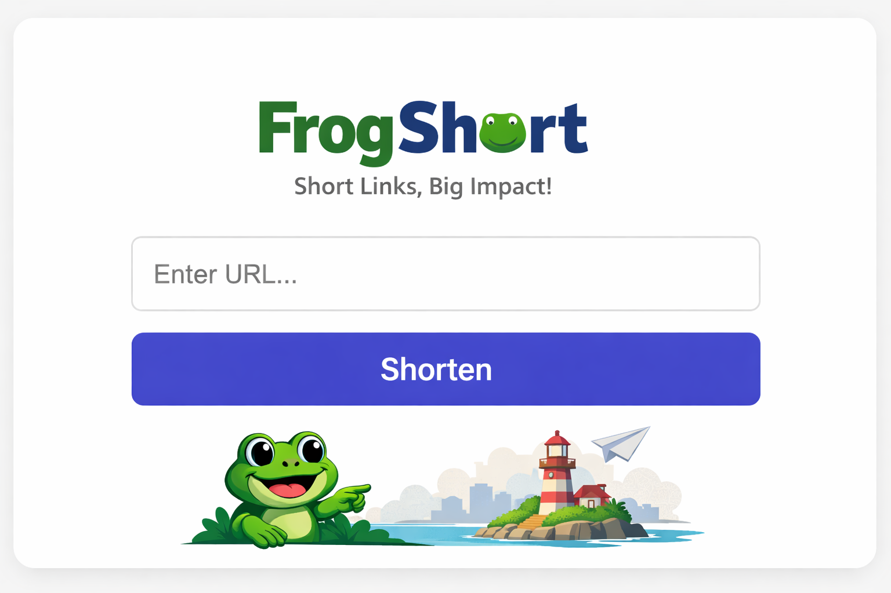

<br/>

<details>
<summary>🇬🇧 ENGLISH VERSION</summary>
Minimal Go URL shortener.

## Roles & Scope
Backend (**Go**), HTTP **API** design, persistence (**PostgreSQL**), env-based configuration.  
Fully containerized with **Docker** and **docker-compose**.

# Features
  - `POST /url` - creating short links
  ```json
  {
    "url": "https://example.com"
  }
  ```
  Request:
  ```json
  {
    "short": "http://localhost:{PORT}/aB3kL9Q"
  }
  ```
  redirect to the original URL  
  `GET /{code}` → 302 + Location: <original_url>

ex:
```bash 
make run
```
```bash
 curl -X POST http://localhost:{PORT}/url \
  -H "Content-Type: application/json" \
  -d '{"url":"https://example.com"}'
```
</details>

---

<details> <summary>🇫🇷 FRENCH VERSION</summary>
Un raccourcisseur d'URL minimaliste en Go.

## Rôles et domaines d'application
Backend (**Go**), conception de **API** HTTP, stockage des données (**PostgreSQL**), configuration basée sur l'env.
Entièrement containerisé avec **Docker** et **docker-compose**.

## Fonctions
  - `POST /url` - créer des liens courts
  ```json
  {"url": "https://example.com"}
  ```
  Réponse:
  ```json
  {"short": "http://localhost:{PORT}/aB3kL9Q"}
  ```
  redirection vers l’URL d’origine  
  `GET /{code}` → 302 + Location: <original_url>

ex:
```bash 
make run
```
```bash
 curl -X POST http://localhost:{PORT}/url \
  -H "Content-Type: application/json" \
  -d '{"url":"https://example.com"}'
```
</details>

---

<details>
<summary>🇷🇺 RUSSIAN VERSION</summary>
Минималистичный URL-shortener на Go.

## Роли и области применения
Бэкенд (**Go**), проектирование HTTP **API**, хранение данных (**PostgreSQL**), конфигурация на env.
Полностью контейнеризирован с помощью **Docker** и **docker-compose**.

## Функции
  - `POST /url` - cоздание коротких ссылок
  ```json
  {"url": "https://example.com"}
  ```
  ответ:
  ```json
  {"short": "http://localhost:{PORT}/aB3kL9Q"}
  ```
  редирект на оригинальный URL  
  `GET /{code}` → 302 + Location: <original_url>

ex:
```bash 
make run
```
```bash
 curl -X POST http://localhost:{PORT}/url \
  -H "Content-Type: application/json" \
  -d '{"url":"https://example.com"}'
```
</details>

<br/>

# FrogShort
A simple, clean, production-ready URL shortener.  
Fast like a frog jump. 🐸💨

## Authors
Full pipeline design  
Made with 🤍 by:
- [monkeydioude](https://github.com/monkeydioude)
- [N0fish](https://github.com/N0fish)

> This project was developed by The calq Studio Team (N0fish, monkeydioude) in December 2025.
